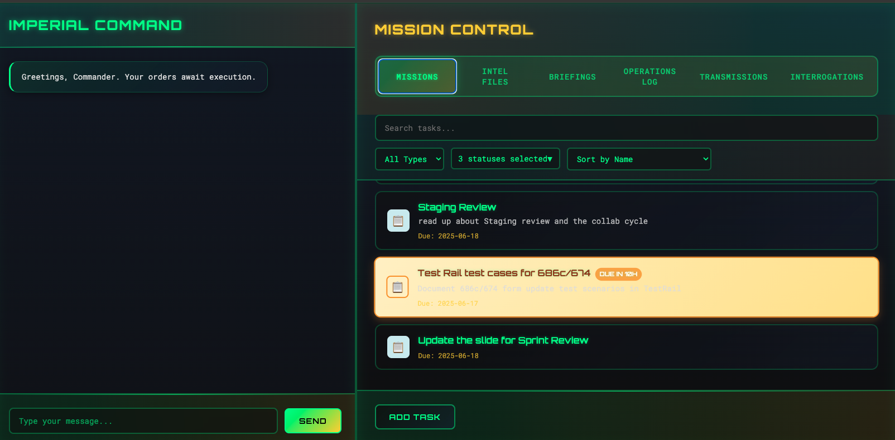

# Multi-Agent Automation System with RAG

A sophisticated multi-agent system using the Model Context Protocol (MCP) for automation, quality assurance, and intelligent document processing. The system orchestrates specialized agents to handle various tasks including web search, file management, code analysis, and contextual information retrieval through an enhanced RAG (Retrieval Augmented Generation) system.



*The application features a sleek, dark Star Wars-inspired interface with a dual-pane layout: Imperial Command chat on the left and Mission Control workspace on the right, complete with task management, document indexing, and real-time agent interactions.*

## 🚀 Key Features

### **Multi-Agent Architecture**
- **Primary Orchestration Agent**: Intelligently routes requests to specialized subagents
- **Brave Search Agent**: Web search and research capabilities
- **Filesystem Agent**: File and directory management, document indexing, and image analysis (calendar & conversations)
- **GitHub Agent**: Repository and development workflow integration
- **Slack Agent**: Team communication and notifications
- **Analyzer Agent**: Test report analysis and insights
- **RAG Agent**: Enhanced document search and contextual retrieval

### **Enhanced RAG System**
Our RAG (Retrieval Augmented Generation) agent supports:

#### **Document Indexing Capabilities**
- **Single File Indexing**: Index individual files with intelligent content parsing
- **Directory Indexing**: Recursively process entire directories with filtering options
- **Multi-Format Support**: Handles various text formats (.py, .js, .ts, .html, .css, .md, .txt, .json, .xml, .yaml, .yml, .sh, .sql, .env, etc.)
- **Smart Chunking**: Overlapping text chunks with intelligent boundary detection
- **Rich Metadata**: Tracks file paths, chunk indices, and source information

#### **Image Analysis Features**
- **Calendar Screenshot Analysis**: Extract events from calendar images using OpenAI Vision API
- **Conversation Screenshot Analysis**: Parse chat conversations and index them for retrieval
- **Automatic Text Extraction**: Convert images to searchable text

#### **Advanced Features**
- **Dual Storage Options**: 
  - Local: ChromaDB vector store with Neo4j graph database
  - Cloud: Supabase (pgvector) with Neo4j Aura for scalable cloud deployment
- **File Type Detection**: Automatic MIME type and extension-based filtering
- **Recursive Processing**: Optional subdirectory scanning
- **Extension Filtering**: Target specific file types for indexing
- **Error Handling**: Comprehensive error reporting and recovery
- **Batch Processing**: Efficient handling of large directory structures

## 📋 Prerequisites

- Python 3.8+
- Node.js and npm (for MCP servers)
- Required API keys (see Environment Setup)

## 🛠️ Installation

1. **Clone the repository**
   ```bash
   git clone https://github.com/hnvt1989/automation-agents
   cd automation-agents
   ```

2. **Create and activate virtual environment**
   ```bash
   python -m venv venv
   source venv/bin/activate  # On Windows: venv\Scripts\activate
   ```

3. **Install dependencies**
   ```bash
   pip install -r requirements.txt
   ```

4. **For development (optional)**
   ```bash
   pip install -r requirements-dev.txt
   pip install -e .  # Install package in development mode
   ```

## ⚙️ Environment Setup

Create a `local.env` file in the project root with the following variables:

```env
# Model Configuration
MODEL_CHOICE=gpt-4o-mini
BASE_URL=https://api.openai.com/v1
LLM_API_KEY=your_openai_api_key
OPENAI_API_KEY=your_openai_api_key  # For embeddings
VISION_LLM_MODEL=gpt-4o  # For image analysis

# Agent API Keys
BRAVE_API_KEY=your_brave_search_api_key
GITHUB_TOKEN=your_github_personal_access_token
SLACK_BOT_TOKEN=your_slack_bot_token
SLACK_APP_TOKEN=your_slack_app_token
SLACK_TEAM_ID=your_slack_team_id

# File System Configuration
LOCAL_FILE_DIR=/path/to/your/local/files
LOCAL_FILE_DIR_KNOWLEDGE_BASE=/path/to/knowledge/base

# Optional Configuration
DEBUG=false
LOG_LEVEL=INFO

# Cloud Storage Configuration (Optional)
# For Supabase Vector Storage
SUPABASE_URL=https://your-project.supabase.co
SUPABASE_KEY=your_supabase_anon_key

# For Neo4j Aura Knowledge Graph
NEO4J_URI=neo4j+s://your-instance.databases.neo4j.io
NEO4J_USER=neo4j
NEO4J_PASSWORD=your_neo4j_password

# Storage Mode (auto, true, false)
USE_CLOUD_STORAGE=auto
```

### **Required API Keys**

| Service | Purpose | How to Get |
|---------|---------|------------|
| **OpenAI** | Primary language model & vision | [OpenAI API](https://platform.openai.com/api-keys) |
| **Brave Search** | Web search capabilities | [Brave Search API](https://api.search.brave.com/) |
| **GitHub** | Repository access | [GitHub Personal Access Token](https://github.com/settings/tokens) |
| **Slack** | Team communication | [Slack App Dashboard](https://api.slack.com/apps) |

### **Cloud Storage Setup (Optional)**

For scalable cloud deployment, see the [Cloud Setup Guide](docs/cloud_setup.md) which covers:
- Supabase configuration for vector storage
- Neo4j Aura setup for knowledge graphs
- Migration from local to cloud storage

## 🚀 Usage

### **Starting the System**

**Option 1: New Modular Application (Recommended)**
```bash
./run.sh
# Or directly:
python -m src.main
```

**Option 2: Simple Mode (without MCP servers)**
```bash
./run_simple.sh
# Or directly:
python -m src.main_simple
```


The system will:
1. Initialize storage (ChromaDB locally or Supabase/Neo4j if configured)
2. Start all MCP servers (using npx to auto-download if needed)
3. Launch interactive chat interface

**Quick Start for Cloud Indexing:**
```bash
# 1. Configure cloud services in local.env (see Environment Setup above)

# 2. Test connections
python scripts/test_cloud_connection.py

# 3. Index your documents
./index_docs.sh  # Indexes data/meeting_notes and data/va_notes

# 4. Start the system and search
./run.sh
# Then: "search for meeting notes about project planning"
```

### **Core Commands**

#### **File Indexing**
```
# Index a single file
index the file at /path/to/document.txt

# Index a directory
index all Python files in ./src directory

# Index with filtering
index all .md and .txt files in ./docs directory
```

#### **Document Search**

**Local Search (ChromaDB):**
```
# Search indexed content
what is Huy's job title?

# Search with context
find information about authentication in the codebase
```

**Cloud Search (After Bulk Indexing):**
```
# Search in cloud-indexed documents
search for meeting notes about project planning

# Find specific entities
find all action items from last week

# Search by document type
show me VA notes about testing

# Knowledge graph queries
find all entities related to budget discussions
```

#### **Bulk Cloud Indexing**

Index entire directories to cloud services (Supabase for vector search + Neo4j Aura for knowledge graphs):

**Prerequisites:**
1. Configure cloud services in `local.env`:
   ```env
   SUPABASE_URL=https://your-project.supabase.co
   SUPABASE_KEY=your_supabase_anon_key
   NEO4J_URI=neo4j+s://your-instance.databases.neo4j.io
   NEO4J_PASSWORD=your_neo4j_password
   ```

2. Run the SQL schema in Supabase (found in `scripts/supabase_vector_schema.sql`)

**Testing & Verification:**
```bash
# Test cloud connections
python scripts/test_cloud_connection.py

# Test vector search functionality
python scripts/test_vector_search.py

# Check what's already indexed
./index_docs.sh --check-only
```

**Indexing Commands:**
```bash
# Index default directories (data/meeting_notes, data/va_notes)
./index_docs.sh

# Skip already indexed files (default behavior)
./index_docs.sh

# Force re-index all files
./index_docs.sh --force

# Clear and re-index from scratch
./index_docs.sh --clear

# Index specific directories
./index_docs.sh --directories data/custom_dir data/another_dir

# Index specific file types
./index_docs.sh --extensions .md .txt .doc

# Combine options
./index_docs.sh --force --directories data/notes --extensions .md
```

**What Gets Indexed:**
- Document content split into contextual chunks
- Metadata: file paths, dates, titles, document types
- Entities: dates, emails, topics, action items
- Relationships in knowledge graph

**Troubleshooting:**
- If you get duplicate key errors, the documents are already indexed (use `--force` to re-index)
- For type mismatch errors, run `scripts/fix_match_documents_function.sql` in Supabase
- Use `--check-only` to see what's already indexed

See the [Indexing Guide](docs/indexing_guide.md) for detailed documentation.

#### **Image Analysis**

**Calendar Events:**
```
analyze the image data/calendar.png and write the calendar events to data/meetings.yaml
```

**Conversation Analysis:**
```
analyze the conversations from data/chat.png and index to the knowledge base
```

#### **Planning**
```
# Create daily plan
plan

# Plan for specific date
plan tomorrow
plan 2025-01-15
```

### **Other Agent Examples**

#### **Web Search**
```
Search for the latest Python best practices
```

#### **File Operations**
```
List all Python files in the current directory
Create a file summary.txt with the project overview
```

#### **GitHub Integration**
```
Get the latest issues from my repository
Create a new issue about the bug in authentication
```

#### **Slack Communication**
```
Send a message to the #general channel about deployment status
```

### **Frontend Interface**

1. Start the API server for WebSocket and REST endpoints:
   ```bash
   uvicorn src.api_server:app --reload
   ```
2. Open `frontend/index.html` in your web browser.
   - The Tasks tab reads from `data/tasks.md`.
   - Use the "Index" buttons to send indexing commands to the primary agent.
   - Click "Index all" on a tab to index every item.

## 🏗️ Architecture

### **Project Structure**
```
automation-agents/
├── src/
│   ├── agents/          # Individual agent implementations
│   │   ├── rag_cloud.py # Cloud-enabled RAG agent
│   │   └── ...
│   ├── core/            # Configuration, constants, exceptions
│   ├── mcp/             # MCP server management
│   ├── processors/      # Data processors (crawler, image, calendar)
│   ├── storage/         # Storage layer (ChromaDB, Supabase, Neo4j)
│   │   ├── supabase_vector.py  # Supabase vector storage
│   │   ├── neo4j_cloud.py      # Neo4j Aura client
│   │   └── ...
│   ├── utils/           # Utilities (logging)
│   └── main.py          # Main application entry point
├── tests/               # Test suite
├── data/                # Data files (tasks, logs, meetings)
│   ├── meeting_notes/   # Meeting documentation
│   └── va_notes/        # VA-related notes
├── docs/                # Documentation
│   ├── cloud_setup.md   # Cloud services setup guide
│   └── indexing_guide.md # Document indexing guide
├── scripts/             # Utility scripts
│   ├── index_to_cloud.py        # Bulk document indexing
│   ├── test_cloud_connection.py # Test cloud connections
│   ├── supabase_vector_schema.sql # Vector DB schema
│   └── fix_match_documents_function.sql # SQL fixes
├── index_docs.sh        # Indexing wrapper script
└── requirements.txt     # Python dependencies
```

### **Agent Communication Flow**
```
User Input → Primary Agent → Specialized Subagent → External Service/Tool
                ↓
         Orchestrated Response ← Processed Result ← Service Response
```

### **RAG System Architecture**
```
Files/Directories → Content Reader → Text Chunker → ChromaDB → Vector Search → Context Retrieval
```

## 📊 Data Files

The system uses YAML files in the `data/` directory:

- **tasks.yaml**: Task management with priorities and due dates
- **daily_logs.yaml**: Completed work logs
- **meetings.yaml**: Meeting schedule (can be auto-populated from calendar images)

## 🔧 Configuration

### **Logging**
Logs are stored in the `logs/` directory with rotation. Configure log level via `LOG_LEVEL` environment variable.

### **ChromaDB**
Vector database files are stored in `chroma_db/` directory. The database persists between sessions.

### **MCP Servers**
MCP servers are automatically managed using `npx`. No manual installation required - they download on first use.

## 🧪 Testing

Run tests with:
```bash
pytest tests/
```

For coverage report:
```bash
pytest tests/ --cov=src --cov-report=html
```

## 🔧 Development

### **Code Quality**
```bash
# Format code
black src/ tests/

# Sort imports
isort src/ tests/

# Type checking
mypy src/

# Linting
flake8 src/ tests/
```

### **Pre-commit Hooks**
```bash
pre-commit install
pre-commit run --all-files
```

## 📝 Troubleshooting

### **Common Issues**

**MCP Server Connection Fails**
- The system uses `npx` to auto-download MCP servers
- Ensure Node.js and npm are installed
- Check API keys in environment variables

**ChromaDB Initialization Error**
- Ensure write permissions for `./chroma_db/` directory
- Check available disk space

**Image Analysis Not Working**
- Verify OPENAI_API_KEY is set
- Check VISION_LLM_MODEL is set (default: gpt-4o)
- Ensure image files exist and are readable

**Planning Feature Issues**
- Ensure data/*.yaml files exist
- Check date formats in YAML files

## 🤝 Contributing

1. Fork the repository
2. Create a feature branch (`git checkout -b feature/amazing-feature`)
3. Make your changes following the code style
4. Add tests for new functionality
5. Run tests and code quality checks
6. Commit your changes (`git commit -m 'Add amazing feature'`)
7. Push to the branch (`git push origin feature/amazing-feature`)
8. Open a Pull Request

## 📄 License

This project is licensed under the MIT License - see the LICENSE file for details.

## 🚀 Migration from Legacy Code

If you're migrating from the legacy monolithic structure:
1. The new modular structure provides better maintainability
2. All functionality has been preserved and enhanced
3. See `MIGRATION.md` for detailed migration instructions

---

**Built with** ❤️ **using PydanticAI, ChromaDB, and Model Context Protocol**