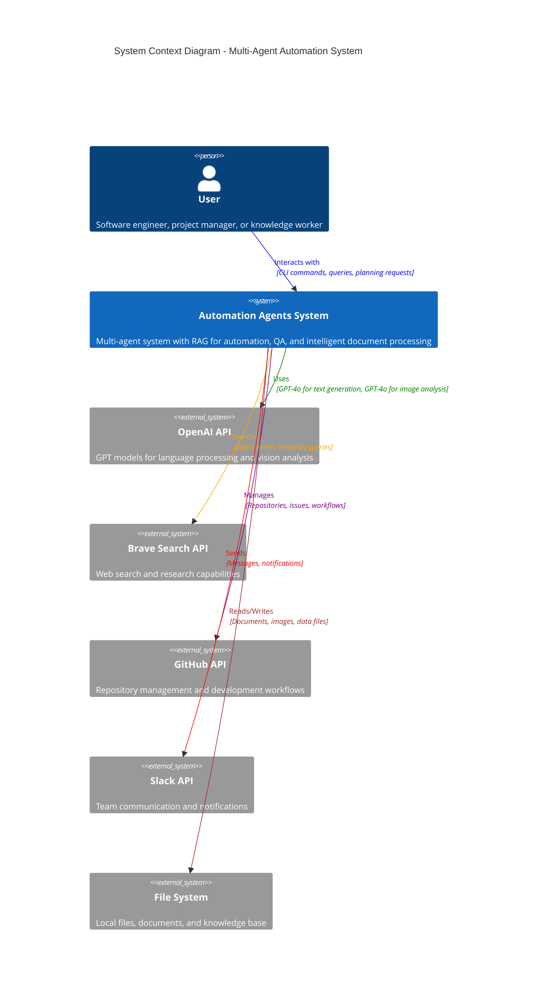

# C4 Model - Level 1: System Context Diagram

## System Overview

The **Multi-Agent Automation System** is a sophisticated AI-powered automation platform that orchestrates specialized agents to handle various tasks including:

- **Web Search & Research** via Brave Search API
- **File Management & Analysis** through filesystem operations
- **Code Analysis & Development** using GitHub integration
- **Team Communication** via Slack notifications
- **Document Processing & RAG** with ChromaDB vector storage
- **Calendar & Conversation Analysis** using OpenAI Vision API

## Key Actors

- **User**: Primary actor who interacts with the system through CLI commands for automation tasks, planning, and information retrieval

## External Systems

- **OpenAI API**: Provides language models (GPT-4o-mini, GPT-4o) for text generation and vision analysis
- **Brave Search API**: Enables web search and research capabilities
- **GitHub API**: Facilitates repository management and development workflows
- **Slack API**: Handles team communication and notification delivery
- **File System**: Stores and manages local documents, images, and knowledge base files

## Core Capabilities

1. **Multi-Agent Orchestration**: Intelligent routing of requests to specialized agents
2. **RAG-Enhanced Knowledge Retrieval**: Vector-based search through indexed documents
3. **Image Analysis**: Calendar and conversation extraction from screenshots
4. **Planning & Task Management**: YAML-based task and meeting management
5. **Model Context Protocol (MCP)**: Extensible server architecture for tool integration