# C4 Model - Level 2: Container Diagram

```mermaid
C4Container
    title Container Diagram - Multi-Agent Automation System
    
    Person(user, "User", "Software engineer, project manager, or knowledge worker")
    
    Container_Boundary(automation_system, "Automation Agents System") {
        Container(cli, "CLI Interface", "Python/Rich", "Interactive command-line interface for user interactions")
        Container(primary_agent, "Primary Agent", "PydanticAI", "Orchestrates requests and delegates to specialized agents")
        Container(mcp_manager, "MCP Manager", "Python/asyncio", "Manages Model Context Protocol servers and connections")
        
        ContainerDb(vector_db, "Vector Database", "ChromaDB", "Persistent vector storage for document embeddings and semantic search")
        ContainerDb(file_storage, "File Storage", "YAML/JSON", "Task management, logs, and meeting data")
        
        Container_Boundary(agents, "Specialized Agents") {
            Container(brave_agent, "Brave Search Agent", "PydanticAI", "Web search and research")
            Container(filesystem_agent, "Filesystem Agent", "PydanticAI", "File operations and management")
            Container(rag_agent, "RAG Agent", "PydanticAI", "Document indexing and retrieval")
            Container(planner_agent, "Planner Agent", "Python", "Task planning and scheduling")
        }
        
        Container_Boundary(processors, "Data Processors") {
            Container(image_processor, "Image Processor", "OpenAI Vision", "Calendar and conversation analysis")
            Container(crawler_processor, "Crawler Processor", "Python", "Web content extraction")
            Container(calendar_processor, "Calendar Processor", "Python", "Calendar event parsing")
        }
        
        Container_Boundary(mcp_servers, "MCP Servers") {
            Container(brave_server, "Brave Search Server", "Node.js/npx", "MCP server for Brave Search API")
            Container(filesystem_server, "Filesystem Server", "Node.js/npx", "MCP server for file operations")
            Container(github_server, "GitHub Server", "Node.js/npx", "MCP server for GitHub API")
            Container(slack_server, "Slack Server", "Node.js/npx", "MCP server for Slack API")
        }
    }
    
    System_Ext(openai, "OpenAI API", "GPT models for language processing and vision")
    System_Ext(brave_search, "Brave Search API", "Web search capabilities")
    System_Ext(github, "GitHub API", "Repository management")
    System_Ext(slack, "Slack API", "Team communication")
    System_Ext(local_filesystem, "Local Filesystem", "Documents and knowledge base")
    
    %% User interactions
    Rel(user, cli, "Uses", "Commands, queries")
    
    %% CLI to core components
    Rel(cli, primary_agent, "Delegates", "User requests")
    Rel(cli, planner_agent, "Calls directly", "Planning commands")
    
    %% Primary agent orchestration
    Rel(primary_agent, brave_agent, "Delegates", "Search queries")
    Rel(primary_agent, filesystem_agent, "Delegates", "File operations")
    Rel(primary_agent, rag_agent, "Delegates", "Knowledge retrieval")
    
    %% Agent to MCP Manager
    Rel(brave_agent, mcp_manager, "Uses", "MCP connections")
    Rel(filesystem_agent, mcp_manager, "Uses", "MCP connections")
    Rel(rag_agent, mcp_manager, "Uses", "MCP connections")
    
    %% MCP Manager to servers
    Rel(mcp_manager, brave_server, "Manages", "Process lifecycle")
    Rel(mcp_manager, filesystem_server, "Manages", "Process lifecycle")
    Rel(mcp_manager, github_server, "Manages", "Process lifecycle")
    Rel(mcp_manager, slack_server, "Manages", "Process lifecycle")
    
    %% Data processors
    Rel(rag_agent, image_processor, "Uses", "Image analysis")
    Rel(rag_agent, crawler_processor, "Uses", "Content extraction")
    Rel(planner_agent, calendar_processor, "Uses", "Event parsing")
    
    %% Storage
    Rel(rag_agent, vector_db, "Reads/Writes", "Embeddings, search")
    Rel(planner_agent, file_storage, "Reads/Writes", "Tasks, logs, meetings")
    Rel(filesystem_agent, file_storage, "Reads/Writes", "Data files")
    
    %% External API connections
    Rel(brave_server, brave_search, "Calls", "HTTPS/REST")
    Rel(github_server, github, "Calls", "HTTPS/REST")
    Rel(slack_server, slack, "Calls", "HTTPS/REST")
    Rel(filesystem_server, local_filesystem, "Accesses", "File I/O")
    Rel(image_processor, openai, "Calls", "Vision API")
    Rel(primary_agent, openai, "Calls", "Chat completions")
    
    UpdateLayoutConfig($c4ShapeInRow="3", $c4BoundaryInRow="2")
```

## Container Overview

The system is organized into several key container layers:

### **User Interface Layer**
- **CLI Interface**: Rich-based command-line interface providing interactive user experience

### **Orchestration Layer**
- **Primary Agent**: Central orchestrator that intelligently routes requests to specialized agents
- **MCP Manager**: Manages lifecycle and connections to Model Context Protocol servers

### **Agent Layer**
- **Brave Search Agent**: Handles web search and research queries
- **Filesystem Agent**: Manages file operations and directory management
- **RAG Agent**: Provides document indexing, retrieval, and semantic search
- **Planner Agent**: Handles task planning, scheduling, and calendar management

### **Processing Layer**
- **Image Processor**: Analyzes calendar screenshots and conversation images using OpenAI Vision
- **Crawler Processor**: Extracts and processes web content
- **Calendar Processor**: Parses calendar events and meeting data

### **Integration Layer (MCP Servers)**
- **Brave Search Server**: Node.js-based MCP server for Brave Search API
- **Filesystem Server**: MCP server for local file system operations
- **GitHub Server**: MCP server for GitHub API integration
- **Slack Server**: MCP server for Slack API communication

### **Storage Layer**
- **Vector Database (ChromaDB)**: Persistent vector storage for document embeddings
- **File Storage**: YAML/JSON files for tasks, logs, and meeting data

## Technology Stack

- **Core Language**: Python 3.8+
- **AI Framework**: PydanticAI
- **Vector Database**: ChromaDB
- **MCP Servers**: Node.js (auto-downloaded via npx)
- **UI Framework**: Rich (CLI)
- **Configuration**: Pydantic Settings
- **External APIs**: OpenAI, Brave Search, GitHub, Slack